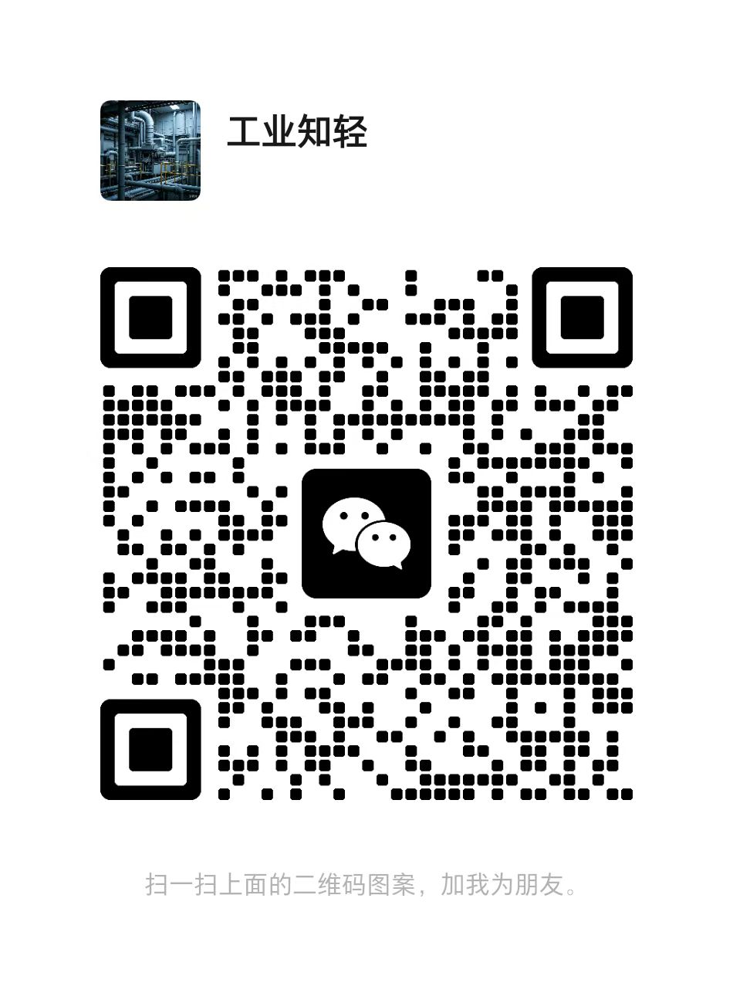

先进生产排程系统
===============

系统介绍
-------
基于智能算法与物联网技术，优化生产资源调度、提升订单履约效率并实现精益化生产管理。通过整合订单、设备、物料、工艺等全要素数据，利用AI驱动的多目标优化算法，动态生成最优生产计划与排程方案。
实现价值

- **智能排产与动态响应**:通过深度学习算法实时分析订单优先级、设备效能与物料动态，结合多目标优化理论（如帕累托前沿分析），自动生成最优排产方案并动态响应突发需求，实现资源受限下的全局最优决策。
- **人机协同透明化管理**:采用单代号网络图、甘特图等拖拽式交互界面，结合可解释AI技术（如动态权重调整的自适应优化），实现算法逻辑透明化与敏捷管理，通过实时可视化界面支持人机协同操作与决策反馈。
- **闭环优化与效率提升**:基于实时数据看板与预测模型（如需求波动预测与库存优化），构建从排程到执行的闭环管理体系，通过强化学习与运筹学融合的动态博弈机制，使决策效率提升40%。
- **柔性生产个性化适配**:支持小批量柔性定制生产模式，兼容离散制造（如多品种小批量单元化产线）与流程制造场景，通过自适应进化算法平衡个性化需求与规模效益，提升客户满意度与市场竞争力。
- **系统集成与应急保障**:无缝对接ERP/MES/PLC等工业系统，实现全链路数据贯通；内置数字孪生故障模拟引擎，通过增量学习技术实现分钟级计划重排，确保紧急订单准时交付与产线稳定运行。
- **经验沉淀与策略优化**:打通PLC控制逻辑与APS决策层，通过工业知识图谱动态沉淀设备参数、工艺规则等生产经验。通过强化学习算法持续学习排产规则，形成可迁移的优化策略库。

功能架构
-------

核心功能
-------
一、**生产指标**

自定义年度/月度生产指标，并在生产过程中实时采集关键数据（如产量、能耗、良品率等），定义指标看板并生成统计报表，内置数据核算规则防止错误输入，异常数据自动触发预警提示，帮助快速定位问题。

二、**排产甘特图**

通过可视化时间轴展示生产计划，支持拖拽调整工序排程。系统根据设备产能、物料库存和订单优先级自动计算最优排产方案，实时显示各产线/机台的任务进度，冲突时段自动标红提醒。

三、**物料平衡**

实时监控原材料、半成品和成品的动态库存，结合生产计划和采购数据自动计算物料缺口。通过流程图直观展示物料消耗与补充过程，预测未来库存波动，提前预警短缺或过剩风险。

四、**计划和工单**

将生产计划转化为可执行的数字化工单，自动关联产品BOM（物料清单）、工艺路线和质检标准。支持批量导入计划或手动创建任务，系统按规则拆分生成车间级工单，实时同步到相关人员和设备。

套餐功能
-------
提供社区版、团队版、企业版套餐，不同版本提供的功能如下。

社区版地址: https://saas.zhumenginfo.com

团队版和企业版内容请联系商务合作人员+86 18922204972

商务合作
-------
官网首页: [https://zhumenginfo.com](https://zhumenginfo.com)

联系方式：+86 18922204972

